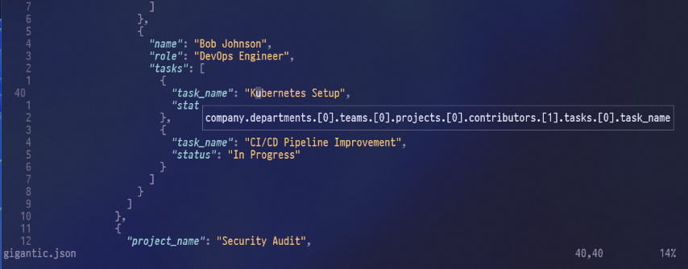

# jsonpath.nvim

## Screenshot



## lazy.nvim

```lua
return {
  "philippdrebes/jsonpath.nvim",
  dependencies = { "nvim-treesitter/nvim-treesitter" },
  config = function()
    local jsonpath = require("jsonpath")
      jsonpath.setup()
      vim.keymap.set("n", "<leader>jp", function() jsonpath.show_json_path() end, { desc = "Show JSON Path" })
      vim.keymap.set("n", "<leader>jpy", function() jsonpath.yank_json_path() end, { desc = "Yank JSON Path" })
  end,
}
```
